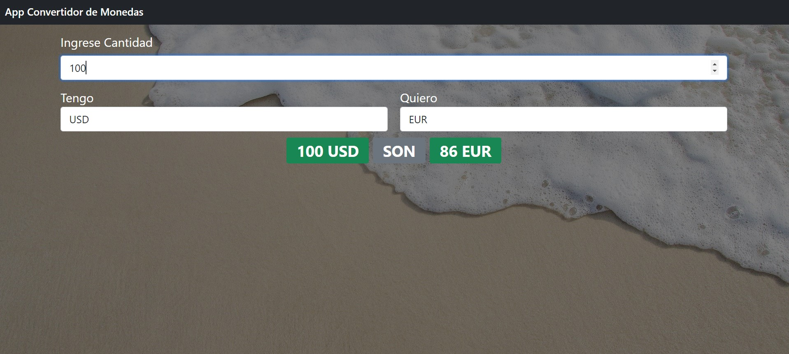

# Angular Convertidor Monedas

App que realiza Conversión de Monedas implementado en Angular.

# Configuración
Ejecuta `ng serve` y navega en `http://localhost:4200/` para visualizar el proyecto.

## Vista Previa

